# **J Automation**
automation repo for Behavior Driven Development (BDD) testing. This testing using user side point of view.

## Tools stack
Stack used for this automation is:
- Ruby
- Cucumber
- Selenium for *Web Automation*
- Appium for *Mobile Automation*

## Docker conf
````

docker build -t e2e-runner .
docker run --env-file=saucelab.android.env -e SAUCELAB_USER='arpitkrgupta' -e SAUCELAB_ACCESSKEY='72c44cae-5755-4ef9-b166-*****' -v $(pwd):/qe-automation e2e-runner;

````

## Setup
Setup instructions:
- <a href="http://www.oracle.com/technetwork/java/javase/downloads/jdk8-downloads-2133151.html">Download</a> and Install Java Development Kit.
- <a href="https://developer.android.com/studio/index.html">Download</a> and Install Android Studio for Android SDK and Emulators.
- Install Xcode **8.2.1** Xcode contains the iOS simulators.
<a href="https://developer.apple.com/download/more/">Download</a> or <a href="https://drive.google.com/open?id=0B3cXuEjE3ytlVF9EdnVyMWRjQzA">Mirror</a>
- Set up below in bash profile if using bash shell.
  - Open Terminal and type command:
    
    `open -a TextEdit ~/.bash_profile`

  - Put This Code on `.bash_profile`:

    ```bash    
    export JAVA_HOME=$(/usr/libexec/java_home)
    export JDK_HOME=$(/usr/libexec/java_home)

    export ANDROID_HOME=/Users/[your mac name]/Library/Android/sdk
    export PATH=$ANDROID_HOME/platform-tools:$PATH
    export PATH=$ANDROID_HOME/tools:$PATH
    ```
  - And `Save` the file
  - Open Terminal and type command :

    `source ~/.bash_profile`

  - Please refers to this Video <a href="https://www.youtube.com/watch?v=VB5QxcAqSbA">Tutorial</a> for more details

- run install shell script:
  ```bash
  sh install.sh
  ```

More about  <a href="https://github.com/appium/">Appium</a>

More about <a href="https://github.com/appium/appium-desktop">Appium Desktop</a>

### Setup for real iOS device
To run the test case on iOS real device, For iOS Simulator we might not need this.

WebDriverAgent configuration on Xcode

 1. Go to :
 <br /> `/usr/local/lib/node_modules/appium/node_modules/appium-xcuitest-driver/WebDriverAgent/
 `
 2. On Terminal :
 <br /> `mkd -p Resources/WebDriverAgent.bundle`
 3. On Terminal :
 <br /> `sh ./Scripts/bootstrap.sh -d`
 4. Move to :
 <br /> `/usr/local/lib/node_modules/appium/node_modules/appium-xcuitest-driver`
 5. On Terminal :
 <br /> `Sudo chmod -R 777 . appium-xcuitest-driver/*`
 6. Open `WebDriverAgent.xcodeproj` with Xcode
 7. Build WebDriverAgent project with sign by click Add Account button
 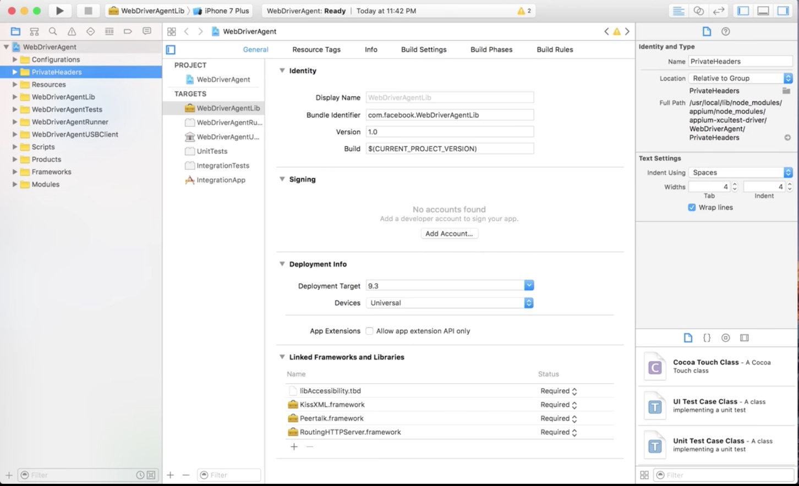

 8. Sign In with your Apple ID and Password
 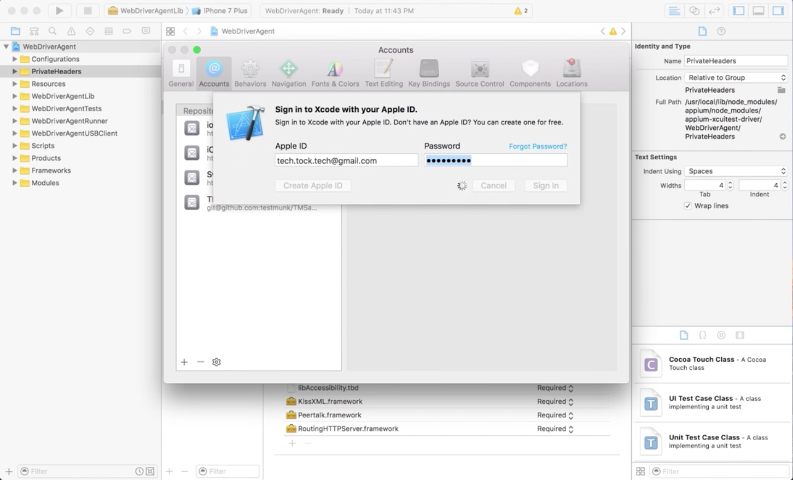

 9. Open WebDriverAgentLib and choose the Provisioning Profile based on your login previously
 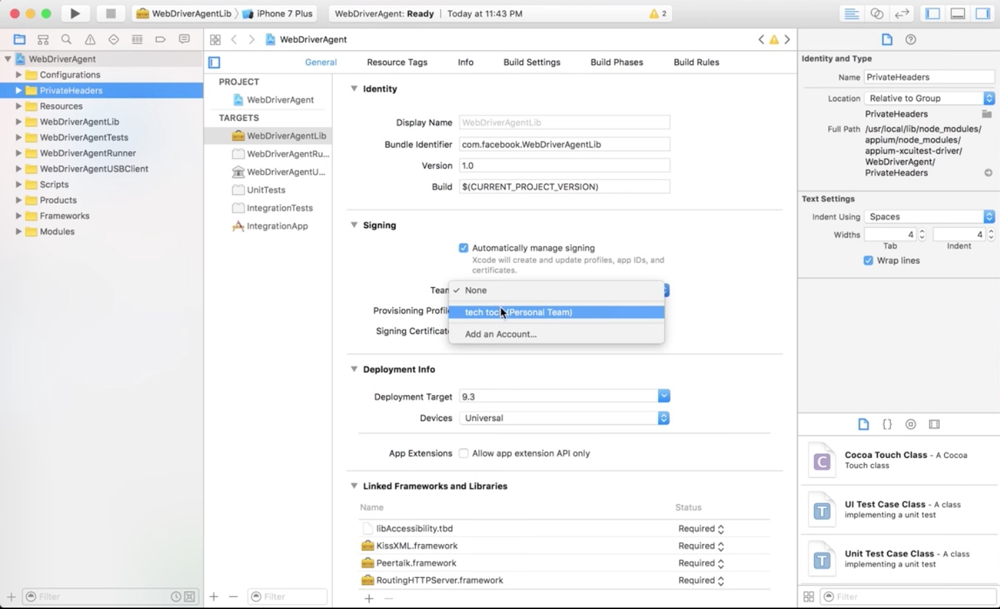

 10. Run WebDriverAgent by click Play button and Build Succeeded
 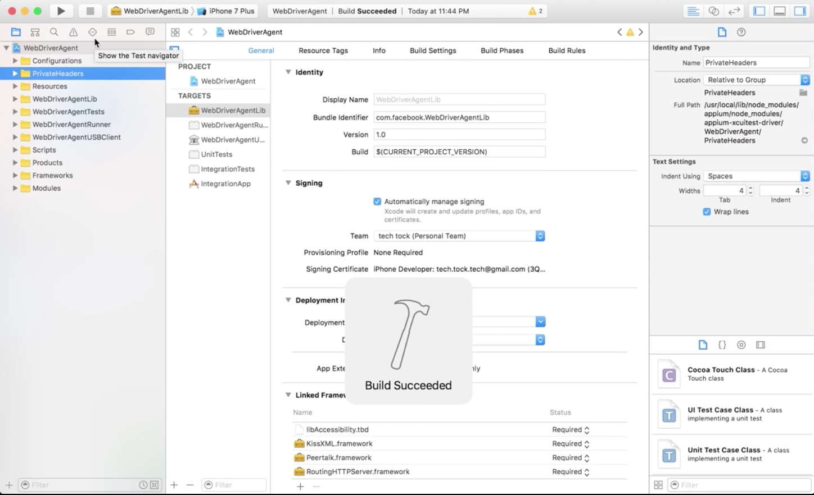

 11. Open WebDriverAgentRunner
 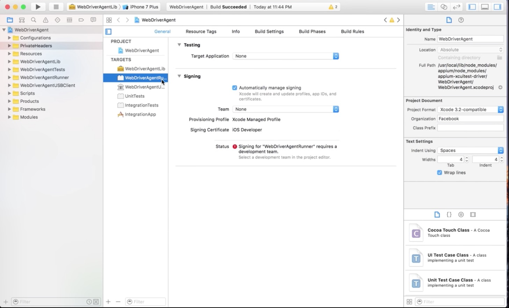

 12. Choose the Provisioning Profile based on your login
 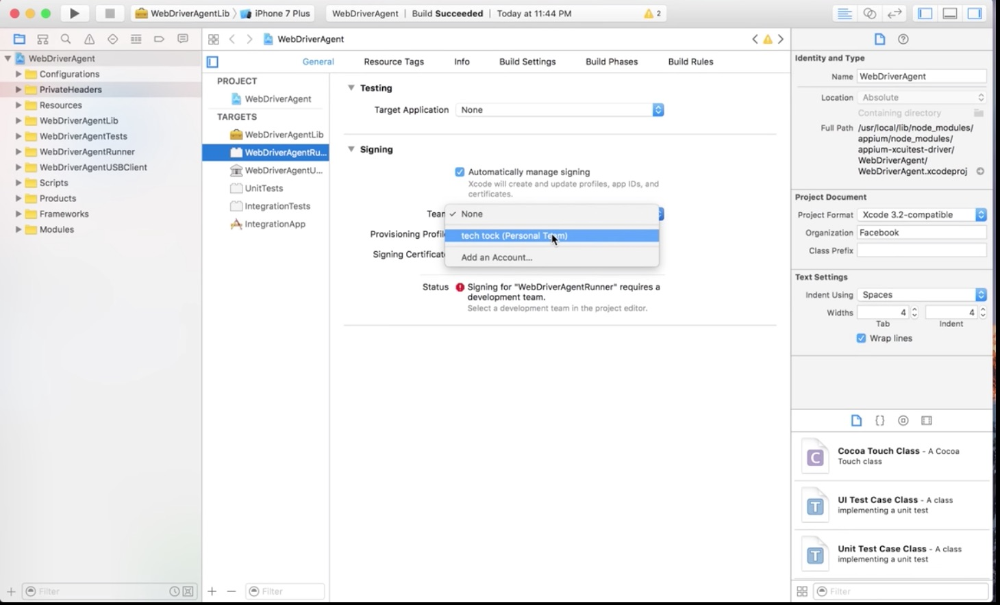

 13. Failed Provisioning Profile status will appear
 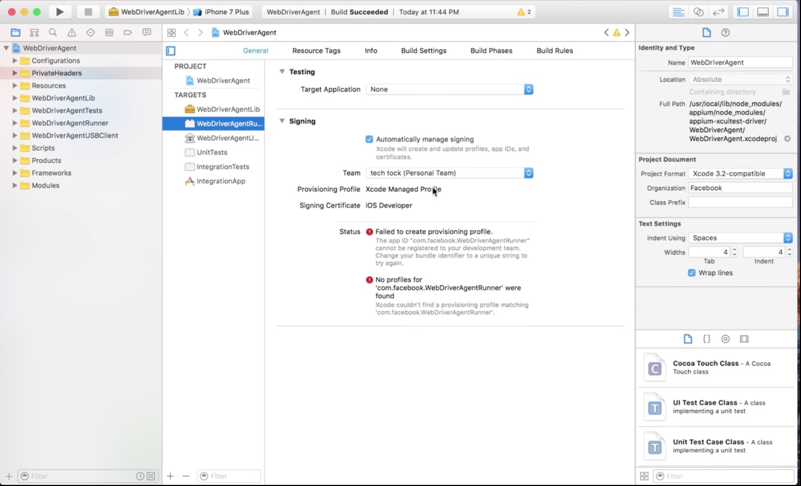

 14. Open Build Settings Tab and make change on Product Bundle Identifier
 <br />*Note*: Sometimes need try more to get match bundle identifier or use real device
 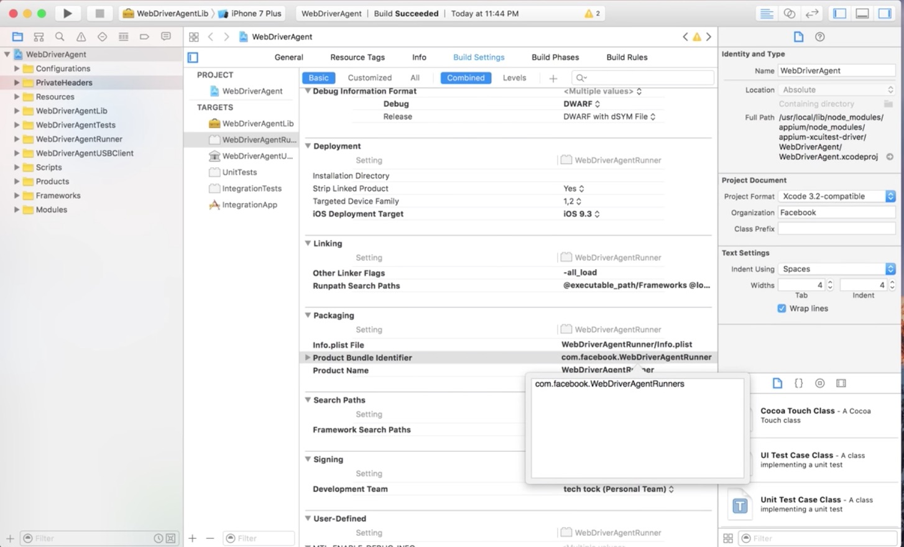

 15. Back to General tab make sure Failed Provisioning Profile status will not appear
 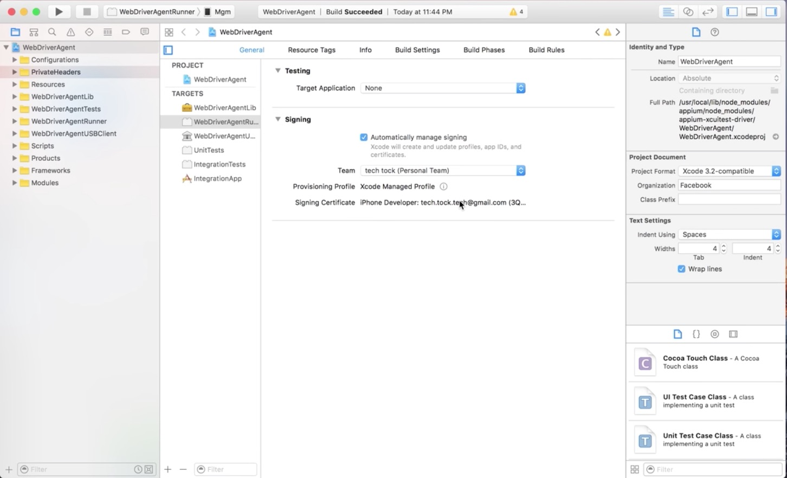

 16. Run WebDriverAgent by click Play button and Build Succeeded
 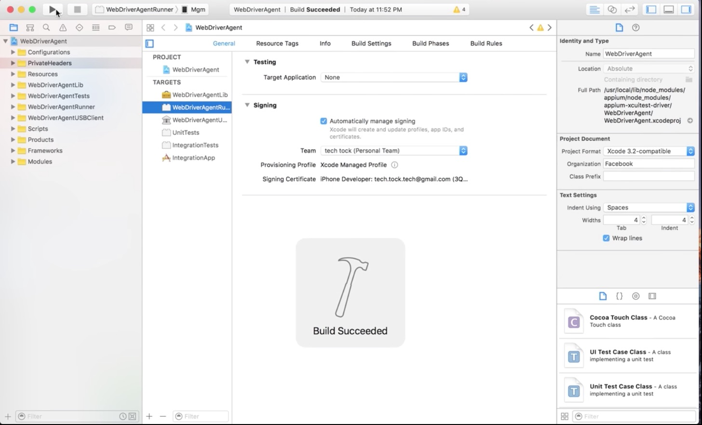

 17. Open IntegrationApp
 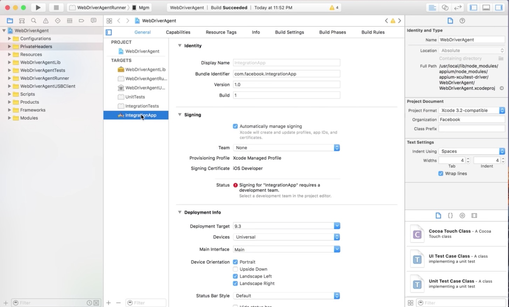

 18. Choose the Provisioning Profile based on your login previously
 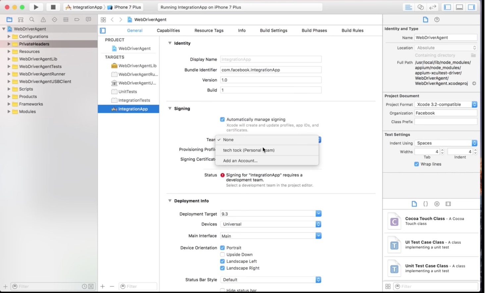

 19. Failed Provisioning Profile status will appear
 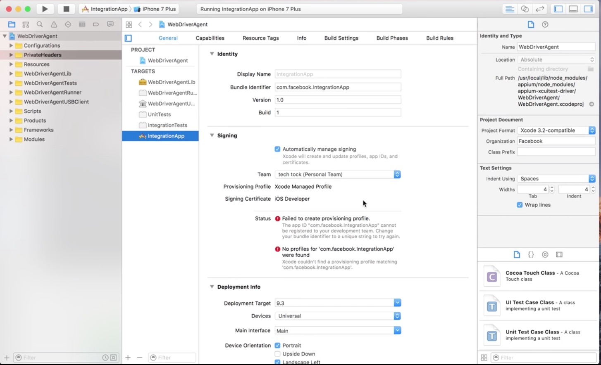

 20. Make change on Bundle Identifier field
 <br />*Note*: Sometime need more time to get match bundle identifier or use real device.
 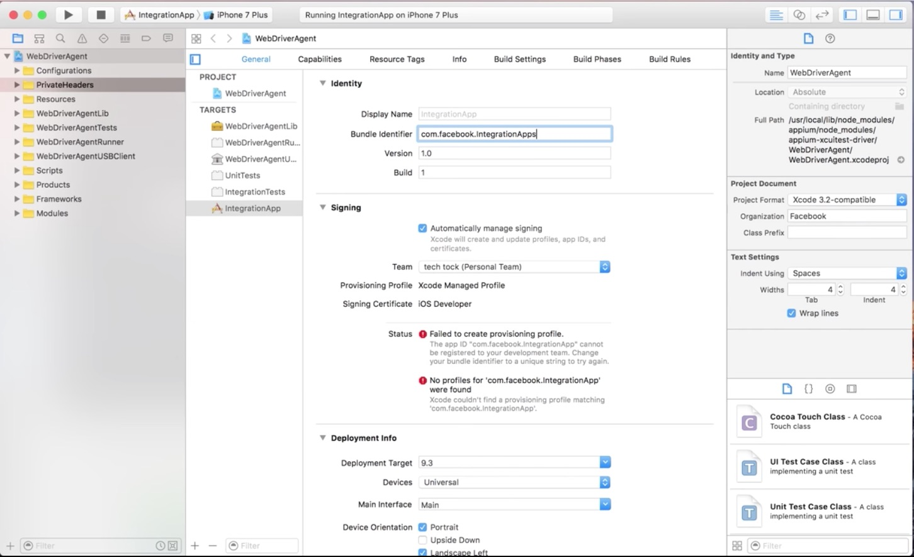

 21. make sure Failed Provisioning Profile status will not appear
 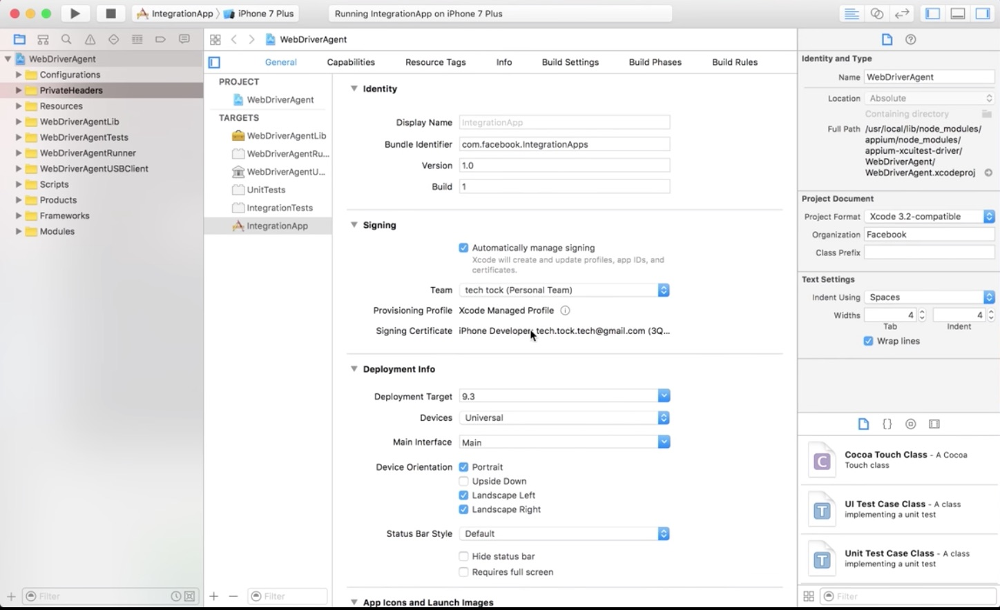

 22. Run IntergrationApp by click Play button and Build Succeeded

 More about  <a href="https://github.com/appium/appium-xcuitest-driver#configuration
 https://github.com/appium/appium-xcuitest-driver/blob/master/docs/real-device-config.md">Appium-Xcuitest-Driver</a>

##### Setup on iPhone/iPad
- Install application from dashboard.buddybuild.com
  When first time installation in Real iOS device, make sure you profile is trusted:
  - Go to :
    <br /> `Settings >> General >> Profiles & Device Management`
  - Make sure Configuration Profile contain:
    <br /> `Buddybuild.com Config`
  - Developer App contain :
    <br />`<your login account in Provisioning Profile>`
- Please see WebDriverAgent Video <a href="https://www.youtube.com/watch?v=ySglJIrDVMQ">Tutorial</a> for more details

## Implement Automation Test Script
You can clone git repo and open code on the sublime editor. Below are the steps to implement the automation script :
-  Create Cucumber Feature
<br />Cucumber feature files contains all the scenarios that covered all handled by each squads.
<br />Eg. Squad Maverick that handled Dashboard.
<br />Create file named Dashboard Feature. Based on the below picture
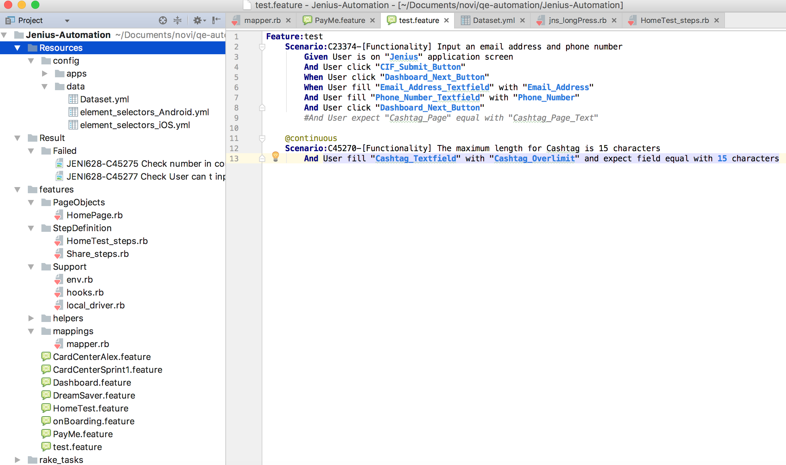
- Create Scenario on Cucumber Feature
<br />All the test steps on the cucumber file written in gherkin syntax that supported by cucumber. After create the test steps, this feature can be run.
<br />On the text editor window, there will be some suggestion to implement the cucumber gherkin language to step definition.
<br />Eg

 You can implement step definitions for undefined steps with these snippets:
```ruby
 Given (/^/^User is on "([^"]*)" application screen$/$/) do
    pending # express the regexp above with the code you wish you had
 End
```
- Create Step definitions
<br />Create the step definition on the additional scenario that added before on the test_steps.rb
<br />This file is located on the features/step_definition folder. Copy the code suggestion on the text editor window and paste into test_steps file.
<br />Implement all the needed action/step definition on the test_steps.

- Go to the Rakefile
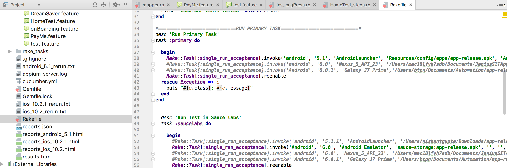
<br />Describe all the setup environment on the rakefile task.
<br />For Android, all the task is handled on task called primary
And for the ios, all the task is handled on task called iOS

- Called Task single_run_acceptance
<br />On the primary/ios task will handle a task called single_run_acceptance

```ruby
desc 'Run acceptance tests on the selected platform (android/ios)'
task :single_run_acceptance, :execution_environment, :app_language, :platformName, :platformVersion, :deviceName, :app, :avd, :udid, :tags, :saucelab_job_name, :saucelab_user_name, :saucelab_access_key, :test_rail_flag, :automation_name, :xcode_org_id, :xcode_signing_id do |_, args|

  Rake::Task[:start_appium_server].execute

  result = run_Cucumber_rake_task('run_acceptance', args[:platformName], args[:platformVersion],args[:deviceName], args[:app], args[:avd], args[:udid], args[:tags], args[:automationName], args[:xcodeOrgId], args[:xcodeSigningId])

  begin
	    Rake::Task[:stop_appium_server].execute
  rescue Exception => e
	    puts "#{e.class}: #{e.message}"
  end

  raise 'Cucumber tests failed' unless result
end
```
We need to describe all the parameter that needed on single_run_acceptance in sequence such as,

 1. execution_environment (uat/sit in which you want to execute)
 2. app_language (english/bhasa)
 3. platformName (whether android/ios)
 4. platformVersion (android version/ ios version)
 5. deviceName
 6. app (location of the apk/app)
 7. avd (using avd only, if using the android emulator. If it’s not then keep it as blank(‘ ’))
 8. udid (using udid only for running on ios real device)
 9. tags (declare the tags if needed to run selected feature/scenarios)
 10. saucelab_job_name (specify the name of automation job name in saucelab which user want to appear)
 11. saucelab_user_name 
 12. saucelab_access_key
 13. **test_rail_flag (specify true if you want to update the result in test rail else false)
 14. automationName (eg. XCuiTest)
 15. xCodeOrgId (using for ios real device only, Team Signing that already set on XCode-WebDriverAgent)
 16. xCodeSigningId (using for ios real device only. By default is “iPhone Developer”)
 
## Note

- If you set the test_rail_flag value as true then you need to specify test_rail configuration details in /assets/integration/test_rail.yml

````
url: "https://****.testrail.net/"
user_name: "arpit_kumar_gupta@external.*****.com"
access_key: "A3PCmlkKF7c********.qCcrFAVfltZ"
run_id: "2030"

````
- Running all the feature by calling the rake task file whether primary or ios.
<br />Open the terminal, located the directory on the project folder directory. <br />Type the rake task to execute selected rake

## Project Structure
```
.
├── Gemfile                             # Describe gem dependencies  
├── Gemfile.lock
├── Rakefile                            # Specify the task and describe dependencies
├── ReadMe.md
├── assets
│   └── readme
│       ├── AutomationTestFramework.png
│       ├── Rakefile.png
│       ├── Setup_WDA_1.jpg
│       ├── Setup_WDA_10.jpg
│       ├── Setup_WDA_11.jpg
│       ├── Setup_WDA_12.jpg
│       ├── Setup_WDA_13.jpg
│       ├── Setup_WDA_14.jpg
│       ├── Setup_WDA_15.jpg
│       ├── Setup_WDA_16.jpg
│       ├── Setup_WDA_2.jpg
│       ├── Setup_WDA_3.jpg
│       ├── Setup_WDA_4.jpg
│       ├── Setup_WDA_5.jpg
│       ├── Setup_WDA_6.jpg
│       ├── Setup_WDA_7.jpg
│       ├── Setup_WDA_8.jpg
│       └── Setup_WDA_9.jpg
├── cucumber.yml
├── features
│   ├── Support
│   │   ├── env.rb                    # File contains all the capability setup
│   │   ├── hooks.rb                  # Contains all the steps that we will do before the scenario and after scenario
│   │   └── local_driver.rb           # Define all the function to start the driver, start the app, stop the app, and restart the driver
│   ├── card_center.feature
│   ├── dashboard.feature
│   ├── dream_saver.feature
│   ├── helpers                       # Contains all the action at we use to run the test steps                           
│   │   ├── ****_click.rb
│   │   ├── ****_display.rb
│   │   ├── ****_expect.rb
│   │   ├── ****_fill.rb
│   │   ├── ****_find.rb
│   │   ├── ****_get.rb
│   │   ├── ****_hidekeyboard.rb
│   │   ├── ****_longpress.rb
│   │   ├── ****_scroll.rb
│   │   ├── ****_swipe.rb
│   │   └── ****_wait.rb
│   ├── mappings
│   │   └── mapper.rb                # Define how to load the yml file or configure the
│   ├── onboarding.feature
│   ├── page_objects
│   │   └── home_page.rb             # Contains all the element on that screen and called the helper to do the action
│   ├── pay_me.feature
│   └── step_definition
│       ├── share_steps.rb          # Contains all the steps that can be used as share step definition to be used in another scenario
│       └── test_steps.rb           # Contains all the step definition that will be used to run the feature file
└── resources
    └── config
        └── data
            ├── element
            │   ├── selector_android.yml # Contains all the android element that we use during the testing which is contains the resource id, name, class, index , accessibility label, or xpath
            │   └── selector_ios.yml     # Contains all the ios element that we use during the testing which is contains the resource id, name, class, index , accessibility label, or xpath
            └── test_data.yml            # Contains all the user data parameter that we use during the testing

```

## Command

The following commands are useful when working with this repo:

| Command | Usage | Example |
|---------|-------|---------|
|rake single_run_acceptance[ execution_environment, app_language, platform_name, platform_version, device_name, app, avd, udid, tags, saucelab_job_name, saucelab_user_name, saucelab_access_key, automation_name, xcode_org_id, xcode_signing_id, width_resolution, height_resolution ]| Run Android test | rake single_run_acceptance[uat,english,android,6.0,pixel_6.0,/Users/mac0xjfvh7sdb/Documents/****/AutomateTest/Android-UAT/app-release-10.apk,pixel_6.0,’’,@test,‘’,‘’,‘’,‘’,‘’,‘’,1080,1920] |
| | Run iOS test | rake single_run_acceptance["uat","english","ios","10.2","iPhone","~/Documents/****/AutomateTest/iOS-UAT/****.app","iPhone 7","79D166DA-BBDE-4769-B01E-20E375793E0E","@test",,,,"XCuitest","Gilang Ashshidhiqi","iPhone Developer",750,1334] |

Note: remove all spaces inside brackets

## SauceLabs

Set the two below parameters before running rake command

```
export SAUCE_USERNAME=$SAUCELABS_USERNAME
export SAUCE_ACCESS_KEY=$SAUCELABS_ACCESSKEY
```

### Saucelabs Commands Example

| Platform | Example |
|----------|---------|
| Default | rake single_run_acceptance[ platformName, platformVersion, android emulator name, path of your apk file, avd name, 'udid', tagName ] |
| Android | rake single_run_acceptance[uat,english,android,6.0,pixel_6.0,/Users/mac0xjfvh7sdb/Documents/****/AutomateTest/Android-UAT/app-release-10.apk,pixel_6.0,’’,@test,‘’,‘’,‘’,‘’,‘’,‘’,1080,1920]|
| iOS | rake single_run_acceptance["uat","english","ios","10.2","iPhone","~/Documents/****/AutomateTest/iOS-UAT/****.app","iPhone 7","79D166DA-BBDE-4769-B01E-20E375793E0E","@test",,,,"XCuitest","Gilang Ashshidhiqi","iPhone Developer",750,1334]|

Note: **remove all spaces** inside brackets

You also need to comment the **avd** in desired capabilities for sauce labs.

Since sauce labs is not yet finalised so didn’t parameterise for that but if in future we use sauce labs then we just need to run the above command to run the test cases on SauceLabs.

## Note

Replace the desired capabilities with your configurations where you want to run your test cases.

For more details and step by step instructions, Please follow the detailed documentation at <a href= https://docs.google.com/document/d/1Dn9TfEjx7MLtv5AS3zyzO7-UZRI_lK4NQaf8Imp5tFQ/edit>this link</a>.

## Execution On SauceLab Cloud Using Docker

Please refer following link https://****.atlassian.net/wiki/display/IN/Ruby+Container+Execution+Guidelines